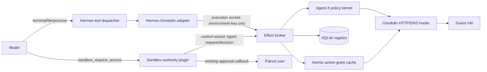
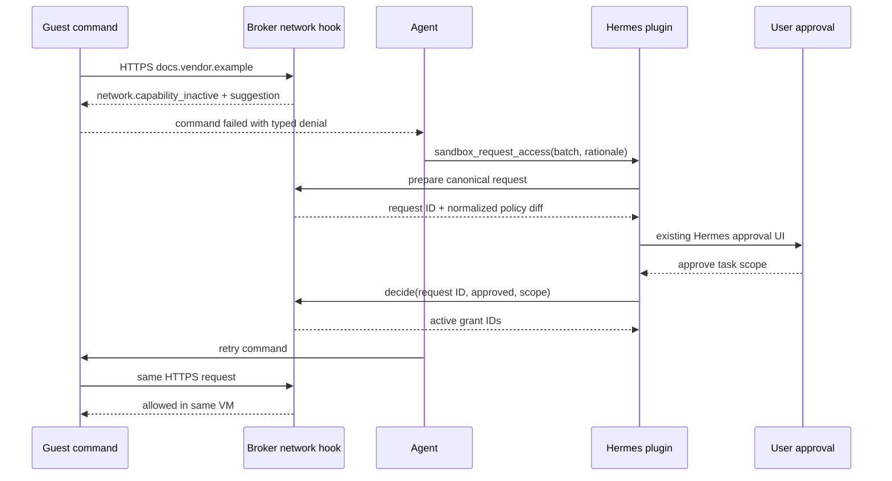

## Context

The QA Effect broker currently receives `worklane` on `POST /v1/environments/ensure`, resolves a fixed worklane policy, and constructs Gondolin network hooks when the VM is created. Hermes is a multi-session gateway, so a process-global lane variable cannot represent concurrent task authority. A model-selected lane is also not authorization.

The pinned Hermes source already provides model-inaccessible task environment overrides, plugin tools, `pre_tool_call` approval escalation, the ordinary approval UI, trusted task/session identifiers, and Kanban lifecycle hooks. The broker already owns SQLite lifecycle state and every guest HTTP/DNS enforcement hook. These are the existing integration points; policy behavior must not be copied into Hermes tool handlers.

The immediate concrete capability is dynamic exact HTTP(S) origin access, including explicitly approved private origins. Credential adapters and other capability kinds need the same grant protocol later but are not implemented as no-ops in this change.

## Goals / Non-Goals

**Goals:**

- Make task/environment authority broker-owned and independent of model-selected executor routing.
- Let an agent learn from a typed denial, batch the missing capabilities, request approval, and retry in the same VM.
- Apply network grants and revocations live through existing Gondolin hooks.
- Support safe defaults, temporary grants, and durable remembered operator rules without a Nix redeploy.
- Bound approval fatigue and render canonical approval facts rather than model-authored security descriptions.
- Keep Hermes changes generic and small.

**Non-Goals:**

- New credentials or credential adapters.
- Arbitrary mounts, QEMU configuration, guest assets, raw protocols, or unmediated networking.
- Making the execution and control sockets separate Unix security principals; the threat model continues to trust the profile gateway process.
- In-place structural VM changes. Asset, mount, workspace authority, backend, and hard-resource changes recreate a generation.
- Partial approval of individual entries inside one batch in the first UI integration; the model may submit a smaller follow-up batch.

## Component Design



The execution socket exposes environment, execution, file, process, status, and health operations. The control socket exposes authority binding, capability preview/request/decision, grant listing, and revocation. Both are mode-0600 and absent from the guest. Interface separation prevents normal adapter code from accidentally turning model fields into authority; it does not claim protection from a compromised trusted gateway process.

## Decisions

### 1. Authority class is separate from executor lane

An authority binding contains:

```text
bindingId, environmentKey, profile, executor,
authorityClass, policyGeneration, createdAt, updatedAt
```

`profile` and `executor` are trusted control-plane context. The broker computes effective defaults from immutable policy. `ensure` no longer accepts a `worklane`; it requires an existing binding or creates a binding using the broker-configured profile default. A conflicting rebind fails closed.

**Alternative:** continue passing `worklane` through `ensure`. Rejected because a normal execution client can then select its own authority and a global environment variable cannot represent concurrent tasks.

### 2. One generic Hermes task-authority identity hook

Extend Hermes' infrastructure-only task environment override registry with a typed `authority_binding_id`. Its presence makes `environment_key(task_id, session_id)` derive a distinct opaque key from the trusted task/session identity plus binding ID. The plugin registers it before first environment use. If access is requested after an environment exists, the current conversation VM remains at its prior authority while subsequent calls for the authority-bearing task use the distinct environment.

The plugin re-registers a Kanban task binding in the worker process during session start using trusted `HERMES_KANBAN_TASK` context. No worklane parameter is added to terminal, file, patch, search, process, or execute-code handlers.

**Alternative:** add `worklane` to every handler. Rejected as high-maintenance duplicated authorization plumbing.

### 3. Runtime grants are typed data

The first implemented capability is:

```json
{
  "kind": "network-origin",
  "scheme": "https",
  "host": "docs.example.org",
  "ports": [443],
  "addressMode": "public-only"
}
```

Private access uses `addressMode: "pinned-private"`. Capability preparation resolves the private hostname before approval and returns canonical pinned addresses. Activation stores those addresses; synthetic DNS returns only the approved pins. IP literals are normalized directly. Public origins continue to resolve dynamically but every answer and redirect must remain outside blocked internal ranges.

Unknown capability kinds, fields, schemes, invalid ports, wildcard hosts, userinfo, URL paths/queries, and unsupported protocols fail closed. An approved request is not effective unless the broker can decode and enforce it.

**Alternative:** permit arbitrary policy JSON. Rejected because approval would become an embedded policy language and unknown behavior could silently broaden access.

### 4. Four policy layers

```text
hard enforcement boundary
  ∩ immutable Nix defaults and installed mechanisms
  ∩ durable remembered operator rules
  ∩ active environment/task grants
  = effective authority
```

The immutable policy defines default origins, installed capability decoders, hard resource limits, and broker mechanisms. It is not a static hostname maximum. An operator may approve a new exact public or private HTTP(S) origin without rebuilding Nix because the installed `network-origin` mechanism can enforce it.

Unsupported mechanisms remain unavailable even after approval. Examples include raw guest credentials, arbitrary QEMU flags, an unmediated NIC, and an arbitrary host mount supplied only as model text.

### 5. Dynamic network evaluation does not recreate the VM

Gondolin HTTP and DNS hooks receive a broker callback that evaluates the request against an atomic in-memory grant snapshot. Grant transactions persist to SQLite first and then replace the snapshot. Activation, revocation, and expiry become visible to subsequent requests without rebuilding hooks or the VM.

A grant is bound to policy generation. Policy mismatch makes it inactive. Broker startup reloads non-expired grants, marks stale-generation grants inactive, and rebuilds the cache before accepting execution requests.

**Alternative:** rebuild the VM for every network grant. Rejected because it destroys useful task state and makes discovery/approval/retry impractical.

### 6. Capability request lifecycle



Preparation never activates authority. It validates and canonicalizes capabilities, resolves private pins, coalesces duplicate requests, applies remembered rules, and returns a broker-rendered summary. The plugin passes that summary to the existing Hermes approval callback. The decision call references the broker request ID; it does not repeat model data.

### 7. Scopes and durable overlays

Supported scopes are:

- `once`: one matching top-level mediated request, consumed atomically;
- `task`: until task completion or explicit revocation;
- `conversation`: until session end/reset or explicit revocation;
- `timed`: until a broker-chosen bounded expiry;
- `profile`: durable exact remembered rule for this broker profile;
- `executor`: durable exact remembered rule for a configured executor lane.

Profile and executor rules are stored in the broker registry with approving principal, creation time, last-used time, policy generation, and revocation state. They are listable and revocable. They never introduce a capability kind the immutable broker does not implement.

The existing Hermes approval choices map to the narrowest compatible scope. `once` maps directly; `session` maps to conversation; `always` is accepted only when policy permits a profile/executor remembered rule and the canonical prompt says it will persist. Task and timed scopes are explicit sandbox tool arguments constrained by policy.

### 8. Approval-fatigue controls are broker state

The broker owns request fingerprints and budgets so gateway restarts do not reset pressure controls:

- one pending request per environment;
- identical pending requests return the existing request ID;
- batches are canonicalized and deduplicated;
- denied fingerprints enter a configurable cooldown;
- a bounded number of new prompts is permitted per task and rolling interval;
- suppressed requests return `approval.request_suppressed` without invoking UI;
- remembered exact rules auto-activate without prompting;
- only an explicit `sandbox_request_access` tool call can prompt; an ordinary network denial never opens UI.

The model supplies rationale for task planning, but the approval's security facts come only from canonical broker fields.

### 9. Execution and control protocols

Systemd supplies named socket-activation descriptors for execution and control listeners. The broker rejects control routes on the execution listener and execution routes on the control listener. Health is available on both for activation checks but does not reveal grant content.

Control operations:

```text
POST /v1/control/authority/bind
POST /v1/control/access/prepare
POST /v1/control/access/decide
POST /v1/control/grants/revoke
POST /v1/control/grants/list
```

Execution `ensure` takes only `environmentKey`. Structured network denials use stable reasons and include a bounded `suggestedCapability` only when the capability is requestable.

### 10. Persistence and concurrency

SQLite gains strict `authority_bindings`, `access_requests`, and `runtime_grants` tables. Mutations use `BEGIN IMMEDIATE`; once-use consumption and revocation are transactional. Grant IDs and request IDs are random UUIDs. Canonical request fingerprints are SHA-256 hashes of normalized capability arrays and binding identity.

The in-memory snapshot is immutable and replaced only after transaction commit. Concurrent network checks observe either the complete old snapshot or complete new snapshot. They never observe partially activated batches.

### 11. Audit and privacy

Audit records include binding ID, opaque environment key, authority class, capability kind, normalized origin, grant scope, decision, reason, policy generation, and timestamps. They exclude command bodies, response bodies, URL paths/queries, headers, credentials, and model rationale by default.

Private resolved addresses are security facts and may be stored in the broker registry, but normal logs show only the approved hostname and address class unless debug diagnostics are explicitly enabled.

### 12. Brokered file operations remain byte-safe

The ongoing QA repair routes patch pre-read, write, and verification through broker file endpoints rather than shell/PTY `cat` output. This is orthogonal to grants but required before the approval plugin can be tested reliably in the same backend. File policy does not become dynamically grantable in this change.

## Risks / Trade-offs

- **The control socket shares the trusted gateway principal.** Interface separation prevents accidental authority plumbing but not malicious code execution in the gateway. Mitigation: the gateway remains trusted by the V3 threat model; neither socket enters the guest.
- **Remembered grants create mutable state outside Nix.** Mitigation: list/revoke/export operations, policy-generation invalidation, timestamps, exact normalized rules, and a fixed-policy rollback mode.
- **Private DNS changes may invalidate pinned addresses.** Mitigation: short default expiry and explicit re-approval on changed pins. Availability is preferred over silently following a rebinding target.
- **Existing Hermes approval choices do not support partial batch selection.** Mitigation: batch approval is all-or-nothing; denial tells the model to request a smaller set.
- **A model can still generate annoying requests.** Mitigation: broker prompt budgets, duplicate coalescing, cooldowns, and no automatic prompt on denial.
- **Per-request grant checks add overhead.** Mitigation: immutable in-memory snapshots and exact-key indexes; SQLite is not queried on each HTTP chunk.
- **Once semantics may be too narrow for package managers.** Mitigation: recommend task/timed origin grants for multi-request workflows and reserve once for exact operation adapters.
- **Dynamic private access increases homelab reachability risk.** Mitigation: exact origin/port, pinned private addresses, redirect re-evaluation, no guest-visible socket, bounded scope, and canonical approval display.

## Migration and Rollback

1. Add registry tables and control protocol while retaining the fixed profile default.
2. Change `ensure` to ignore/remove client worklane selection and bind the configured default.
3. Add live grant evaluation and contract tests with no Hermes integration.
4. Add the generic Hermes authority identity hook and plugin.
5. Enable dynamic grants only for `hermes-qa` on `hvn-hyp1`.
6. Exercise denial, approval, retry, expiry, revocation, restart, and fatigue controls.

Rollback disables the plugin and control socket, revokes/quarantines runtime grants, and leaves the broker on its fixed `project` default. Production remains unchanged; QA may return to the rootless-Podman backend if the broker path is unstable.
