## Context

`add-sandbox-workspace-service` gives a broker-backed Hermes task one mutable workspace, one writer lease, and a Gondolin VM. `add-explicit-worker-lanes` supplies the frozen board/task/run/lane/policy identity used by every worker surface. This slice makes exactly `/workspace/output` durable at completion and makes explicitly selected files deliverable through the trusted local gateway. It does not provide worker-to-worker input mounting.

The boundary crosses Kanban, the Hermes workspace-service bridge, and the broker. Kanban owns task state, selected artifact paths, and the ordinary attempt lifecycle. Trusted dispatch owns the frozen worker binding. The broker owns workspace leases, task-run activations, the finalization journal, immutable handoff trees, and selected-artifact enforcement. Hermes owns required-finalizer invocation, native attachment materialization, recipient upload, and delivery retry.

Guest output is untrusted. Names, links, special files, unreadable entries, and resource excess must not become host capabilities. The broker structurally validates and copies bytes into broker-owned storage after fencing. It performs no content scanning and derives no authority from content hashes.

## Goals and Non-goals

**Goals:**

- Capture exactly `/workspace/output` automatically on successful broker-backed completion, including a valid empty tree.
- Validate explicit human artifact selections against the frozen tree in the same finalization operation.
- Make response loss and post-fence failure recoverable without redispatching producer work or reopening an old activation.
- Serve only selected frozen regular files to the trusted gateway over the protected local control UDS.
- Materialize every broker-selected file through native Hermes task attachment storage before `done`, independent of recipient subscriptions, then preserve recipient retry/cursor correctness.
- Preserve task/run/lane and optional Project/source-generation provenance without granting downstream authority.
- Delete the existing writable child-import path before completing this workstream.

**Non-goals:**

- Dependency inputs, fan-in/fan-out, read-only input mounts, public URLs, or a shared filesystem spool.
- Content scanning, deduplication, content-derived authority, retention/deletion APIs, or long-term Project storage.
- New model-facing workspace, handoff, read, publication, or cancel tools.

## Component Model

```mermaid
flowchart LR
  M[Hermes model] -->|complete with relative artifacts| K[Kanban and trusted dispatcher]
  K -->|frozen run facts and selected paths| P[workspace-service bridge]
  P -->|authenticated local control UDS| B[Gondolin broker]
  B --> H[immutable output handoff]
  H -->|selected file read| A[Hermes native attachment storage]
  A --> R[recipient platform]
```

The model selects only normalized relative artifact paths through the existing completion contract. It cannot name a workspace, lease, handoff, route, storage root, or host path. Summary/result prose does not discover or select files. The hidden handoff identity remains trusted gateway state.

## Decisions

### 1. One capture call freezes output and validates selected artifacts

Before the broker call, Kanban validates only syntax: every selected artifact is a normalized relative path under the trusted task workspace and below `output/`; absolute, traversal, URI/drive/host, empty-segment, and symlink-escape forms fail while the task remains `running`. Native scratch/dir/worktree flows continue to copy each selected file into native attachment storage before `done`.

The required broker-backed finalizer sends `POST /v1/control/workspace-handoffs/capture` with exactly `finalizationId`, trusted `environmentKey`, `taskId`, `runId`, and `selectedArtifacts`; schemas reject extras. The broker authorizes the frozen board/task/run/lane/policy binding and resolves the active activation. It preflights the fixed `/workspace/output` root while the activation and writer lease remain active. Preflight verifies both the tree and that every selected artifact resolves without links to one regular file inside the output root.

After preflight, one broker transaction consumes the exact activation and stages the finalization. The broker revokes the writer lease, marks the VM generation closing, waits for VM exit and VFS callback drain, copies only the fixed output subtree to destination-temporary storage, validates the detached tree and selected paths again, fsyncs, and atomically installs one immutable handoff. The ready response contains the opaque handoff ID, structural counts, and a selected-artifact manifest of normalized path, basename, and size. An empty output tree is valid only with an empty selected-artifact list.

Kanban remains `running` until that ready response exists. A preflight failure leaves the activation and writer available for correction. A post-fence failure remains a broker operation failure under existing task retry handling; it never publishes a partial tree or creates a new Kanban task state.

### 2. Replay follows the journal after fencing

The broker persists the finalization operation before filesystem mutation and binds the finalization ID to source activation, task/run, environment, board/lane revision, optional Project/source generation, workspace/lease, policy digest, fixed output source, and the ordered selected-artifact set. An identical request is idempotent; any changed bound fact conflicts.

If a response is lost before staging or activation consumption, the same finalization ID may preflight the still-active source again. After staging or consumption, replay resolves the journal and resumes or returns the original operation without requiring the source activation to be active. A genuinely fresh producer attempt activates a globally unique new run and allocates a new finalization ID. Old activations and operations remain fenced.

### 3. Completion, block, timeout, and reclaim fence the writer

Before worker spawn, trusted dispatch activates the globally unique task run against the frozen worker binding, workspace, lease, and policy digest. Every ensure, execution, and file operation receives identity from trusted backend state. Stable task identity or lease knowledge alone cannot create a VM or access files.

Capture consumes the activation before output bytes are copied. Block, timeout, and reclaim consume or supersede it before VM close. A late old-run request therefore cannot recreate a generation or mutate retained output. Reclaim does not capture or deliver data.

### 4. Handoff records are immutable lifecycle records

The broker records:

- `task_run_activations`: opaque activation, board/task/run/lane, optional Project/source generation, environment, workspace/lease, policy digest, and lifecycle state;
- `workspace_handoffs`: opaque handoff and finalization IDs, exact source provenance, ordered selected-artifact manifest, structural counts, storage state, and failure detail;
- a finalization journal covering preflight, fencing, copy, detached validation, fsync/rename, ready, quarantine, and failure.

The final tree is broker-owned and immutable. IDs are never paths and never model authority. Failed temporary or quarantine state remains accounted for; no entry is silently removed to make completion succeed.

### 5. Validate structure with exactly four limits

Live preflight and detached validation reject malformed names, absolute or traversal segments, NUL, invalid UTF-8, normalization collisions, symlinks, disallowed hardlinks, sockets, devices, FIFOs, unreadable entries, source filesystem crossings, and excess of:

- `maxLogicalBytes` (sparse files count by logical size),
- `maxEntries`,
- `maxFileBytes`, and
- `maxPathBytes`.

Copying follows no links, crosses no source filesystem boundary, preserves no hardlinks, and carries no source ownership, timestamps, ACLs, or xattrs. Detached validation checks independent destination identity, normalized modes, readability, selected regular-file identity, and the same four limits before fsync and atomic rename. Copying bytes is storage, not content inspection.

### 6. Human delivery is direct local read plus native attachment materialization

The control listener exposes `POST /v1/control/workspace-handoffs/artifacts/read` on the protected local UDS. It accepts exactly hidden `handoffId` and normalized `relativePath`; schemas reject extras. The broker reauthorizes the caller, requires a ready handoff, requires the exact path to appear in its selected-artifact manifest, verifies the frozen node is still one regular file with the recorded size, and streams only that file. It never reads the live workspace, widens selection to a directory, infers paths, or creates a shared spool.

Hermes reads every selected file into upstream native task attachment storage before transitioning Kanban to `done`. This task/file materialization is idempotent, durable, independent of recipient subscriptions, and makes the artifact available through ordinary task attachment inspection even when no platform recipient exists. Platform delivery begins from the durable native attachment, not the broker workspace. Recipient upload is a separate durable stage: an upload failure leaves that recipient/attachment outstanding and must not advance its completion-event subscriber cursor. Retry reuses the native attachment and targets only missing recipient deliveries. A platform timeout may still produce a duplicate when the platform provides no idempotency key; this is documented at-least-once behavior rather than hidden token machinery.

An explicit later human request to receive completed-task files reuses the existing `kanban_attachments` surface with `action="deliver"` rather than adding another model-facing tool. The default `list` action remains metadata-only. The tool result carries board, task, and selected filenames but no host paths; the trusted gateway resolves those filenames back to immutable native attachment rows and sends them through the current platform. This path does not create rows, copy bytes, reread Gondolin, or rerun the producer. If broker-completion and later manual attachments coexist, an unspecified delivery selects the broker-completion set.

### 7. Local gate and listener boundary

Activation, capture, and selected-artifact read routes exist only on the authenticated broker control listener and only while `workspaceHandoffEnabled` is true. Disabled startup creates no handoff schema, storage root, or policy actions. The execution listener exposes no handoff-management route or handoff metadata.

The gateway and broker communicate only over the protected local UDS. A broker outage keeps capture or delivery retryable and never falls back to local execution, Docker, Podman, host paths, a live workspace, or an empty substitute.

## Risks and Trade-offs

- **Two databases:** durable Kanban intent and broker-bound finalization IDs provide replay without pretending the databases share a transaction.
- **Hostile trees:** no-follow preflight, writer fencing, four explicit limits, detached validation, and atomic rename constrain filesystem capability leakage.
- **Response loss:** journal-first identity separates replay of one finalization from a deliberate new run.
- **Trusted gateway:** direct local reads are appropriate because the mode-0600 UDS already authenticates the trusted gateway account; this is not a tenant boundary.
- **At-least-once delivery:** platform ambiguity can duplicate a recipient document; local broker machinery cannot manufacture exactly-once behavior.
- **Storage lifecycle:** no retention or deletion API is exposed here; pending delivery continues to reference the ready handoff, and disposable state may be removed wholesale outside active work.

## Implementation Order

1. Complete `add-explicit-worker-lanes` so activation and finalization share one frozen worker identity.
2. Keep the already-completed shared database and task-run activation foundations.
3. Replace partial publication code with journaled immutable handoff capture and selected-artifact manifests.
4. Delete existing writable child-import code, persistence, schemas, prompts, and tests without a compatibility path.
5. Add direct selected-file reads on the local control UDS.
6. Wire completion finalization and idempotent native task attachment materialization before `done`, then add recipient retry and cursor correctness.
7. Wire the local gate, policy, limits, storage, and recovery through Nix.
8. Verify capture, replay, hostile-tree handling, stale-run fencing, delivery retry, and broker outage behavior before `add-broker-project-workspaces` changes the workspace layout.

## Ideas: content-addressed handoff storage

This section is non-normative and deferred. A future implementation may encode a canonical manifest, hash bounded file chunks, and derive a Merkle root for integrity, deduplication, or replication. Random opaque handoff IDs remain authorization and lifecycle identities.

Hashes do not authorize access, prove semantic correctness, detect secrets or malware, provide tenant isolation, or protect against a compromised broker. Before adopting CAS, specify canonical encoding, chunking, collision handling, reference accounting, garbage collection, quotas, and recovery. CAS must preserve the externally visible immutable-handoff and selected-file-read contract unchanged.
