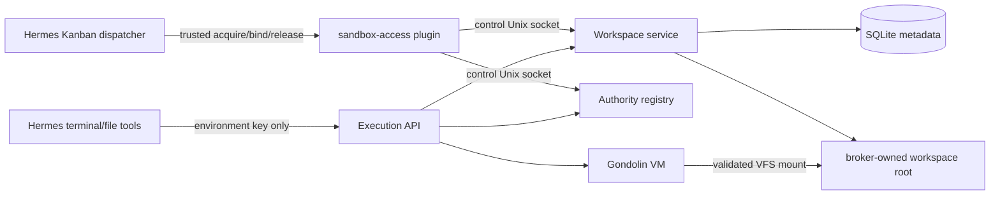
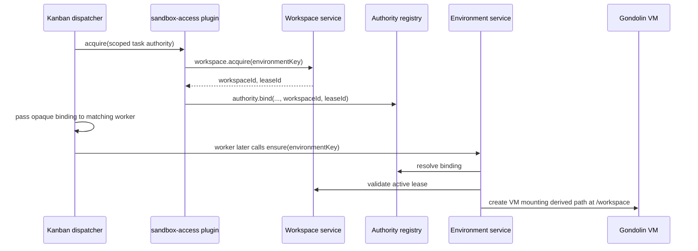
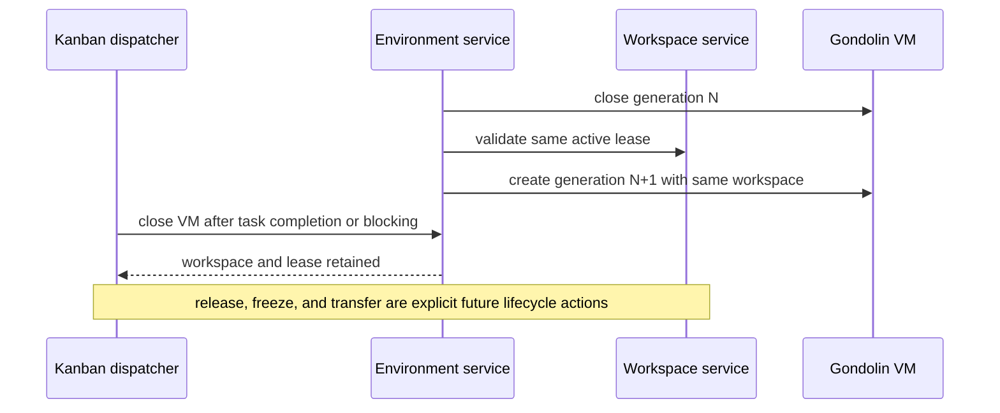

## Context

The Effect broker currently hashes `environmentKey`, creates that directory under `workspaceRoot`, stores the raw path in `environments.workspace_path`, and mounts it into every recreated VM. There is no independent workspace identity, lease, listing, retention, or deletion contract. Hermes Kanban separately persists a gateway host `workspace_path` and injects it as worker cwd, which cannot be the Gondolin guest `/workspace`.

The QA broker state is explicitly reset before activation; the implementation carries no compatibility logic for the previous schema or filesystem layout.

## Goals / Non-Goals

**Goals:**

- Give private sandbox work a stable opaque identity independent of VM generation.
- Persist one writable lease per workspace and fence conflicting writers.
- Remove `environments.workspace_path`; callers never provide host paths.
- Make environment creation resolve a validated broker-owned workspace lease.
- Let trusted Kanban lifecycle code persist/reuse the workspace ID while model-facing schemas expose neither host paths nor workspace selection.

**Non-Goals:**

- Project sources, Git operations, COW optimization, publication, credentials, read-only composite inputs, shared writers, household identity, or production deployment.
- Turning Kanban into the workspace record of truth.

## Decisions

### Two workspace tables and direct environment references

SQLite contains `workspaces` and `workspace_leases`. The `environments` table contains `workspace_id` and `workspace_lease_id`, not a host path. No separate binding table is needed: the authority binding identifies who may act, the active lease identifies writable ownership, and the environment record captures the mount used by that VM generation.

`workspaces` stores only identity/lifecycle metadata: ID, owning environment authority key, kind (`private` initially), state, optional retention deadline, and timestamps. `workspace_leases` stores lease ID, workspace ID, environment key, mode, state, monotonically increasing fencing token, and acquisition/release timestamps. A partial unique index permits one active writable lease for a workspace and one active workspace lease for an environment.

Alternative: add a third `environment_workspace_bindings` table. Rejected because the active lease already is the binding and a second mutable pointer creates disagreement and cleanup obligations.

### Broker-owned IDs and paths

Workspace and lease IDs are random UUIDs. The host path is derived internally as `<workspaceRoot>/data/<workspaceId>` after strict ID validation. Neither execution nor control callers may submit a host path. Directory creation uses mode 0700 and deletion resolves/validates containment before recursive removal.

### Idempotent acquisition

`workspace.acquire(environmentKey, workspaceId?)` is a control-plane operation. With no workspace ID, an existing active lease for the environment is returned; otherwise a new private workspace and lease are created transactionally. With an ID, ownership must match and no conflicting active lease may exist. The first implementation supports only the owning environment key; transfer and cross-task review are deferred.

The execution `ensure` path may create the profile's default private workspace only when automatic default authority binding is permitted. A pre-bound Kanban environment must already have the exact workspace lease registered by trusted lifecycle code. Conflicts fail with stable workspace reason codes.

### Lease and VM lifecycle are separate

Closing, reaping, crashing, or recreating a VM does not release its workspace lease. Task completion and blocking close the live VM but retain the task-private lease and files so a retry can recreate the VM without rebinding broker authority. `workspace.release` is an explicit operator or future handoff transition; it ends the writer lease while retaining files. `workspace.close` marks a released workspace closed. `workspace.delete` requires no active lease, removes the contained directory, and tombstones the row.

Environment reuse requires the same workspace ID and lease ID in addition to authority/policy/asset decisions. A changed lease closes the old VM and creates a new generation. Cross-task transfer is deferred because it requires an explicit revision and handoff authority model rather than mutable authority rebinding.

### Kanban integration stays narrow

The repository-owned `workspace-service` plugin derives a scoped broker authority from trusted Kanban task identity. The dispatcher acquires the task workspace before spawn and passes only `HERMES_WORKSPACE_ID`, `HERMES_WORKSPACE_LEASE_ID`, and `HERMES_WORKSPACE_GUEST_PATH=/workspace`. In broker mode the shared worker launcher removes `HERMES_KANBAN_WORKSPACE`, does not set the gateway scratch directory as `TERMINAL_CWD`, and starts the worker without that directory as process cwd. The task row may still display upstream scratch-workspace bookkeeping, but that path is not the Gondolin workspace or a worker environment input.

Retries derive the same broker authority and reuse the task workspace. Concurrent child tasks derive distinct authorities and workspace IDs. This increment does not import parent files, publish child outputs, or promise useful cross-task project contents.

## Component Diagram

## Sequence Diagrams

### First Kanban claim

### VM recreation and completion

## Risks / Trade-offs

- **Kanban workspace initially contains only private scratch.** This proves lifecycle composition but does not yet make homelab project work useful. Project-provider import is the next change.
- **One environment key owns a workspace.** Sequential cross-task review needs an explicit transfer model later; silently sharing IDs is forbidden.
- **SQLite metadata and filesystem mutation cannot be one transaction.** Acquisition creates the directory before inserting its row and removes that directory if the SQLite transaction rolls back. Explicit deletion removes the directory before recording the tombstone, so an interruption between those operations can leave a closed workspace row whose directory is already absent; retrying deletion converges on the tombstone.
- **Rollback is not data-compatible.** The old binary cannot use new workspace records. QA rollback recreates ephemeral state; production is unaffected.
- **Plugin patch size grows.** Keep broker calls in the repository-owned `workspace-service` plugin and add only generic lifecycle hooks plus opaque ID plumbing to Kanban. Do not add provider, revision, publication, or project logic to Hermes.
