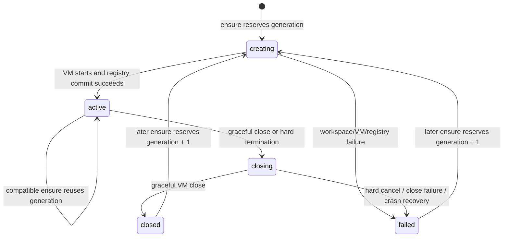

# Gondolin Broker Effect

`gondolin-broker-effect` is the Effect-based HTTP broker selected by the
`secureTerminal.backend = "gondolin"` NixOS path. The QA Hermes profile
currently selects it. The legacy broker remains in-tree and tested as a
measured rollback/comparison implementation; it is not started by that path.

## Current scope

Implemented:

- HTTP/JSON API over a mode-`0600` Unix socket;
- exact request/config decoding;
- shared `@agent-x/policy-kernel` authorization;
- generation-fenced environment ensure/status/close;
- credential-free Gondolin/QEMU VM creation;
- network-disabled guests;
- one durable SQLite environment registry;
- one persistent host workspace per environment key;
- foreground execution as NDJSON events;
- deadline/output/input/concurrency enforcement;
- hard VM close for incomplete or uncooperative commands;
- mediated stat/list/read/write/mkdir/remove operations;
- Effect scopes, read/write lifecycle locks, semaphores, streams, layers, and typed errors;
- fake-runtime lifecycle and real Unix-socket HTTP tests.
- a thin Hermes HTTPX-over-UDS terminal adapter with RFC 9457 error mapping;
- NixOS systemd service and mode-`0600` socket activation wiring;
- inherited-listener, rendered-policy startup, and patched-Hermes contract tests.

Not implemented:

- TCP listening, TLS, remote authentication, or SaaS tenant isolation;
- network bundles, DNS/HTTP mediation, or WebSocket policy;
- credentials, grants, approvals, leases, redaction, audit delivery, artifact export, or reconciliation;
- PTY/background process/notification semantics;
- checkpoint/resume or VM adoption after broker restart;
- per-VM cgroup placement (the static live-environment admission ceiling is enforced);
- V3 Phase 3/4 adversarial, latency, and Podman-parity gates.

The missing items are not implied by the use of Effect. Effect improves application composition and cleanup; Gondolin/QEMU, systemd, cgroups, VFS, policy enforcement, and tests remain the security boundary.

## Architecture

```mermaid
flowchart LR
    H[Hermes / Agent X caller] -->|HTTP over Unix socket| API[HttpRouter]
    API --> S[Exact Effect Schemas]
    S --> A[Authorization service]
    A --> K[@agent-x/policy-kernel]
    API --> E[Environment service]
    API --> X[Executor]
    API --> F[Files service]
    E --> R[(SQLite registry)]
    E --> G[VmRuntime adapter]
    X --> E
    F --> E
    G --> Q[Gondolin / QEMU / KVM]
    Q --> W[RealFS workspace provider]
```

### Ownership

| State or behavior | Owner |
|---|---|
| Policy document and generation | Immutable broker config |
| Pure allow/deny/attenuation | `@agent-x/policy-kernel` |
| Local policy enforcement | `Authorization`, `Environments`, `Executor`, `Files` |
| Latest environment generation/state | SQLite `Registry` |
| Live VM handle and locks | scoped `Environments` service |
| VM construction/destruction | `VmRuntime` Gondolin adapter |
| Command output stream | `Executor` |
| Host workspace confinement | Gondolin `RealFSProvider` plus broker guest-path checks |
| Product identity, grants, approvals, artifacts | Agent X—not implemented here |

## Request flow

```mermaid
sequenceDiagram
    participant C as Caller
    participant H as HTTP router
    participant A as Authorization
    participant K as Policy kernel
    participant E as Environment/operation service
    participant G as Gondolin VM
    participant R as SQLite registry

    C->>H: exact JSON request
    H->>H: Schema decode; reject excess fields
    H->>A: normalized action/resource/limits
    A->>K: registry + immutable policy
    K-->>A: deny or AuthorizedAction
    alt denied
        A-->>H: typed BrokerError
        H-->>C: JSON error and HTTP status
    else allowed
        A-->>E: effective limits + decision digest
        E->>R: validate/reserve generation
        E->>G: bounded local operation
        G-->>E: result/events
        E->>R: state/result transition where applicable
        E-->>H: value or NDJSON stream
        H-->>C: response
    end
```

## Effect patterns used

These choices are deliberate. Pre-1.0 package versions were not excluded merely because of version numbers; each package was judged by fit and operational cost.

### `Context.Tag` and `Layer`

Services are explicit dependencies:

- `BrokerConfig`
- `PolicyKernel`
- `Authorization`
- `Registry`
- `VmRuntime`
- `Environments`
- `Executor`
- `Files`

Production and tests provide different `VmRuntime` layers. There is no runtime “fake fallback” flag in the executable.

`Layer.provideMerge` builds one visible dependency graph. Policy evaluation cannot accidentally depend on Gondolin, SQL, filesystem, network, or credentials because the standalone package has none of those dependencies.

### `Scope` and `Effect.acquireRelease`

- Registry database handles close with their service scope.
- Live VMs close when the environment service scope closes.
- Environment leases use scoped read locks.
- Command concurrency permits release with the stream scope.
- The external Gondolin `AsyncIterable` output is bridged with `Stream.asyncPush` and `Effect.acquireRelease`.

The `asyncPush` bridge is important. Pulling an arbitrary JavaScript `AsyncIterable` directly can leave Effect waiting on a non-cancellable Promise. The push bridge lets stream interruption unsubscribe immediately; the outer finalizer can then hard-close the VM, which releases the SDK producer.

### `TReentrantLock`

Each live environment has a transactional read/write lock:

- ordinary exec/file operations hold a scoped read lease;
- graceful close takes the write lock and waits for active operations;
- hard termination of a leased, uncooperative command intentionally bypasses the writer wait, marks the environment closing, closes the VM, records failure, and removes it from the live map.

That bypass is explicit because waiting for the command's own read lease would deadlock cancellation.

### `TSemaphore`

- one global mutation permit serializes ensure/close/generation transitions;
- one per-environment semaphore enforces concurrent foreground execution limits.

### `Stream`

Foreground execution produces:

1. `start`;
2. zero or more `output` events;
3. `exit`, or a terminal `error` event at the HTTP encoding boundary.

`Stream.interruptWhen` enforces a total deadline. `Stream.ensuring` hard-terminates any environment whose command did not reach a normal result. Client disconnect interrupts the response stream and follows the same cleanup path.

### `Schema`

Config and every HTTP body use exact schemas with `onExcessProperty: "error"`. Unknown fields do not silently disappear. Identifiers, generations, array bounds, integer limits, and canonical base64 are validated before reaching runtime adapters.

### Why not Effect RPC yet

The first replacement transport is ordinary HTTP semantics over a Unix socket:

- easier inspection with standard HTTP tooling;
- explicit status/content-type/stream behavior;
- no dependency on one RPC package's evolving wire format;
- a direct path to a remote HTTP service later.

This is not permission to expose the current listener over TCP. A SaaS deployment needs TLS, authenticated principals, tenant isolation, quotas, replay/idempotency rules, and a remote capability design first.

### Why SQLite is currently `node:sqlite`

The first registry uses Node's built-in synchronous SQLite API behind an Effect service:

- no additional native module;
- no `better-sqlite3` build/package ownership;
- explicit transactions and schema;
- easy replacement behind `Registry` if product topology changes.

`@effect/sql` was not rejected for being pre-1.0. It is deferred because the current single-table local registry does not yet justify another native driver or SQL abstraction. Reconsider it when Agent X/PostgreSQL repositories, migrations, telemetry, and transactional product state move into the implementation.

## Lifecycle statechart



On broker startup, persisted `creating`, `active`, or `closing` rows are changed to `failed`. The current package does not adopt unknown QEMU processes. That is conservative but incomplete: a production systemd unit must also kill or reconcile stale processes before accepting work.

## HTTP API

### Wire protocol and Hermes client

The broker speaks ordinary HTTP/1.1 over a Unix domain stream socket. The socket
path is transport configuration; it is not encoded into a proprietary URL.
Clients use origin-form paths and a conventional authority such as
`http://localhost`:

```python
import httpx
import json

transport = httpx.HTTPTransport(uds="/run/hermes/gondolin-broker.sock")
with httpx.Client(
    transport=transport,
    base_url="http://localhost",
    timeout=httpx.Timeout(30.0, read=None),
) as client:
    ensured = client.post(
        "/v1/environments/ensure",
        json={"environmentKey": "conversation-abc", "worklane": "default"},
    )
    ensured.raise_for_status()

    with client.stream(
        "POST",
        "/v1/exec",
        json={
            "environmentKey": "conversation-abc",
            "generation": ensured.json()["generation"],
            "argv": ["printf", "hello"],
        },
    ) as response:
        response.raise_for_status()
        for line in response.iter_lines():
            event = json.loads(line)
```

Hermes v2026.7.7.2 already pins `httpx[socks]==0.28.1`, whose
`HTTPTransport` and `AsyncHTTPTransport` both accept `uds=...`. The integration
therefore needs no client dependency and no hand-written socket framing.
Hermes' existing `tools/code_execution_tool.py` UDS transport is a separate,
bespoke RPC protocol and is not reused here.

The conventions are:

- request URLs are `http://localhost/v1/...`; `localhost` is a placeholder
  authority and is never resolved;
- request bodies are UTF-8 `application/json`;
- unary responses are `application/json`;
- execution responses are streaming `application/x-ndjson`, one complete JSON
  event per line;
- pre-stream failures use RFC 9457 Problem Details with
  `application/problem+json`;
- `Cache-Control: no-store` applies to all broker data responses;
- authorization is the mode-`0600` socket plus broker policy, not an HTTP
  bearer credential.

There is no IETF URI scheme for “HTTP over UDS.” Passing the socket path
out-of-band while preserving unmodified HTTP/1.1 messages is the established
client/server convention used by HTTPX, curl's `--unix-socket`, Docker, and
similar local APIs. Do not invent a `unix://` application protocol.

Problem responses carry the standard RFC 9457 members plus stable broker
extensions:

```json
{
  "type": "urn:agent-x:gondolin-broker:error:policy.denied",
  "title": "policy.denied",
  "status": 403,
  "detail": "policy did not authorize the broker operation",
  "reason": "policy.denied",
  "details": {}
}
```

`reason` is the stable programmatic discriminator. `detail` is explanatory and
must not be matched by clients. Details are suppressed for 5xx responses.
Responses include `X-Content-Type-Options: nosniff`. The local socket is mode
`0600`.

### Health

`GET /v1/health`

```json
{ "status": "ok" }
```

### Ensure an environment

`POST /v1/environments/ensure`

```json
{
  "environmentKey": "conversation-abc",
  "worklane": "default"
}
```

Response:

```json
{
  "environmentKey": "conversation-abc",
  "generation": 1,
  "state": "created",
  "worklane": "default",
  "policyGeneration": 1,
  "decisionDigest": "..."
}
```

A compatible live environment returns `state: "reused"`. Policy-generation or worklane changes close and recreate it.

### Status

`POST /v1/environments/status`

```json
{ "environmentKey": "conversation-abc" }
```

### Close

`POST /v1/environments/close`

```json
{
  "environmentKey": "conversation-abc",
  "generation": 1
}
```

Every authority-bearing request after ensure carries the broker-issued generation. Stale generations fail.

### Foreground execution

`POST /v1/exec`

```json
{
  "environmentKey": "conversation-abc",
  "generation": 1,
  "argv": ["sh", "-lc", "printf hello"],
  "cwd": "/workspace",
  "env": { "LANG": "C.UTF-8" },
  "stdinBase64": "",
  "timeoutMs": 30000,
  "outputLimitBytes": 1048576
}
```

Content type: `application/x-ndjson`.

```jsonl
{"type":"start","environmentKey":"conversation-abc","generation":1,"decisionDigest":"...","timeoutMs":30000,"outputLimitBytes":1048576}
{"type":"output","sequence":0,"stream":"stdout","dataBase64":"aGVsbG8="}
{"type":"exit","exitCode":0,"signal":null}
```

After headers are sent, failures are encoded as a terminal NDJSON event because HTTP status can no longer change:

```jsonl
{"type":"error","reason":"exec.timeout","message":"command exceeded its deadline","details":{"timeoutMs":30000}}
```

### Files

All file routes are `POST`:

- `/v1/files/stat`
- `/v1/files/list`
- `/v1/files/read`
- `/v1/files/write`
- `/v1/files/mkdir`
- `/v1/files/remove`

Common fields:

```json
{
  "environmentKey": "conversation-abc",
  "generation": 1,
  "path": "/workspace/file.txt"
}
```

Relative paths resolve under the configured guest workspace root. Absolute paths must already be inside that root. NUL bytes and lexical escapes are rejected.

`read` returns canonical base64. `write` accepts canonical base64 and optional `create`/`truncate`. File size and directory entry ceilings are enforced both before and, for reads, after the underlying operation to catch growth races.

Gondolin's pinned `RealFSProvider` performs lexical and realpath containment against its host root. Broker path checks do not replace that provider boundary.

## Configuration

Environment variables:

| Variable | Required | Meaning |
|---|---:|---|
| `GONDOLIN_EFFECT_POLICY` | yes | Absolute or working-directory-relative JSON policy/config file |
| `GONDOLIN_EFFECT_STATE_DIR` | yes | Registry and workspace state root |
| `GONDOLIN_EFFECT_SOCKET` | no | Unix socket path; defaults under state dir |
| `GONDOLIN_EFFECT_PROFILE` | no | Profile label used in VM session labels |

Example file:

```json
{
  "version": 1,
  "policyGeneration": 1,
  "policy": {
    "version": 1,
    "statements": [
      {
        "effect": "allow",
        "actions": [
          "environment.ensure",
          "environment.status",
          "environment.close",
          "exec.foreground",
          "fs.stat",
          "fs.list",
          "fs.read",
          "fs.write",
          "fs.mkdir",
          "fs.remove"
        ],
        "resources": ["environment:conversation-*"]
      }
    ]
  },
  "defaultWorklane": "default",
  "maxEnvironments": 4,
  "assets": {
    "default": {
      "path": "/nix/store/...-gondolin-root.qcow2",
      "buildId": "rootfs-build-1"
    }
  },
  "worklanes": {
    "default": {
      "asset": "default",
      "memoryMiB": 1024,
      "cpus": 2,
      "workspaceGuestPath": "/workspace",
      "limits": {
        "maxCommandMs": 30000,
        "maxOutputBytes": 1048576,
        "maxInputBytes": 1048576,
        "maxFileBytes": 8388608,
        "maxListEntries": 1000,
        "maxConcurrentExecs": 2
      }
    }
  }
}
```

The credential-free spike passes `supportedObligations: []`. Any policy statement that requires an obligation fails closed until the corresponding PEP exists.

## V3 compatibility matrix

“Compatible” below means behavioral intent, not byte-for-byte transport compatibility.

| V3 behavior/contract | Effect broker status | Compatibility debt / follow-up |
|---|---|---|
| Length-prefixed framed Unix protocol | Replaced by HTTP/JSON and NDJSON over Unix socket; Hermes HTTPX adapter is patched in | Keep the adapter thin; do not add legacy framing to core services |
| Socket-local trust boundary | Preserved by the NixOS mode-`0600`, gateway-owned activation socket | Validate ownership and no TCP listener on the deployed host |
| `ensure` with server generation | Preserved; Hermes sends the canonical conversation-derived environment key | Stop treating conversation strings as the final Agent X product identity model |
| Compatible ensure reuse | Preserved for same worklane and policy generation | V3 also considers asset/template/policy/mount topology; add a complete immutable environment fingerprint |
| Recreate on incompatible state | Partial | Current comparison omits template version, mount topology digest, runtime generation, and adapter generation |
| Durable latest generation/state | Preserved in SQLite | Add migrations, tombstones/retention, crash injection, backup/restore, and multi-process exclusion |
| Restart reconciliation | Conservative rows-to-failed only | Kill/adopt/reconcile actual QEMU processes and stale mounts before listening |
| QEMU/KVM production runtime | Preserved in adapter | NixOS unit must prove `/dev/kvm`, device policy, and hardening compatibility |
| Disposable COW root | Preserved | Validate real guest asset and close/recreate behavior in KVM QA |
| Persistent per-environment workspace | Preserved | Add workspace identity/topology digest, quotas, artifact export, and deletion policy |
| Network mediation bundles | Not implemented; `netEnabled: false` | Port finite DNS/HTTP/WebSocket policy only after the credential-free local slice passes |
| Foreground exec events | Preserved semantically; Hermes consumes the NDJSON envelope | Add event cursor/replay rules only if the product contract requires reconnect |
| Background processes / notify-on-complete | Not implemented | Design Agent X task/process ownership instead of copying legacy flags blindly |
| PTY open/input/resize/close | Not implemented | Define typed PTY lifecycle and cancellation before exposing it |
| Input/output/deadline ceilings | Preserved | Add per-action unit-bearing policy types and adversarial tests |
| Hard cancellation via VM close | Preserved and tested with fake runtime, but intentionally coarse | Gondolin 0.12.0 abort only rejects the host session; it does not confirm guest-process termination. Add guest-side signal/kill-and-confirm before preserving a VM after request loss; until then disconnect cancellation sacrifices ephemeral VM state for containment |
| File stat/list/read/write/mkdir/remove | Preserved semantically | Run path/symlink/hardlink/race/atomic-write and guest/direct-VFS concurrency gates |
| Network, VFS, resource admission | Only VFS basics; network off; no cgroups | V3 Phase 3/4 remains mandatory |
| Static policy/grants | Replaced with shared pure kernel for static policy; grants absent | Agent X owns mutable grants/approvals/budgets; add immutable snapshots and transactional consumption |
| Audit records | Not implemented | Decision digest is not an audit log; add durable request/decision/enforcement/result/publication events |
| Legacy broker error reasons | RFC 9457 body with stable reason/status surfaced by the Hermes adapter | Measure legacy reason parity where callers depend on a specific reason |
| systemd activation and hardening | Wired with inherited FD, dedicated UID, KVM condition, and systemd protections | Prove the evaluated unit against real KVM/VFS workloads on Linux |
| Nix package | Built and selected by the QA Gondolin backend path | Keep the legacy package as tested rollback until parity gates pass |

## Agent X compromises in the broker

The broker currently retains several V3-shaped concepts to make the runtime comparison possible:

1. **`environmentKey` is a flat caller string.** Agent X should supply a canonical identity derived from principal/space/conversation/task/worker/runtime generations.
2. **Worklanes are broker config.** Agent X should own model/tool/runtime selection and pass a reviewed runtime profile reference, not arbitrary VM settings.
3. **Policy is one static file.** Agent X mutable grants, approvals, budgets, credentials, and product facts remain outside this spike.
4. **Resources are formatted strings.** Compatibility translation must move to the API edge; shared policy should receive typed normalized actions.
5. **Registry records only executor lifecycle.** They must never supersede Agent X/PostgreSQL product state.
6. **HTTP has no authenticated principal.** Unix socket ownership is the only caller gate in this local spike.
7. **Decision evidence is returned but not durably correlated.** Product audit/reconciliation is still missing.
8. **Only ordinary foreground exec/file operations exist.** PTY/background semantics need Agent X task/process ownership, not a blind V3 port.

Follow-up design and acceptance gates are also documented in `policy-kernel/README.md`.

## Security properties and non-properties

### Enforced now

- no guest network;
- no credentials supplied to broker or VM;
- production Linux VM requests QEMU/KVM;
- disposable COW root;
- only configured workspace is exposed through Gondolin VFS;
- exact request schemas;
- closed action registry and fail-closed policy;
- generation on every post-ensure operation;
- bounded input/output/time/concurrency/files/listing;
- hard close after incomplete exec;
- local socket only;
- database and state paths created with restrictive modes.

### Not proven by this package

- KVM isolation under hostile guest code;
- kernel/QEMU/Gondolin vulnerability resistance;
- VFS correctness under symlink/hardlink/race attacks;
- complete process-tree termination timing;
- cgroup memory/CPU/process containment;
- host systemd hardening compatibility;
- resource fairness or denial-of-service resistance;
- durable audit or external-effect exactly-once behavior;
- tenant isolation or remote service security.

## Testing and acceptance

Local:

```sh
npm test
```

Nix package, rendered-policy startup, and inherited-socket checks:

```sh
nix build \
  .#checks.aarch64-darwin.gondolin-broker-effect \
  .#checks.aarch64-darwin.secure-terminal-effect-policy-http
```

The fake runtime tests prove broker contracts and cleanup logic, not VM containment.
The current QA selection is an explicit integration stage, not a production parity
claim. Before promotion, run the existing V3 acceptance workload against both
brokers and compare:

- every operation/result/error;
- hard cancellation and stale output;
- path and filesystem race cases;
- anonymous package/Git workflows with the reviewed network policy;
- cold latency and resource ceilings;
- restart, orphan, registry, and workspace behavior.

Then record `continue`, `redesign`, or `retain Podman` as required by V3.
