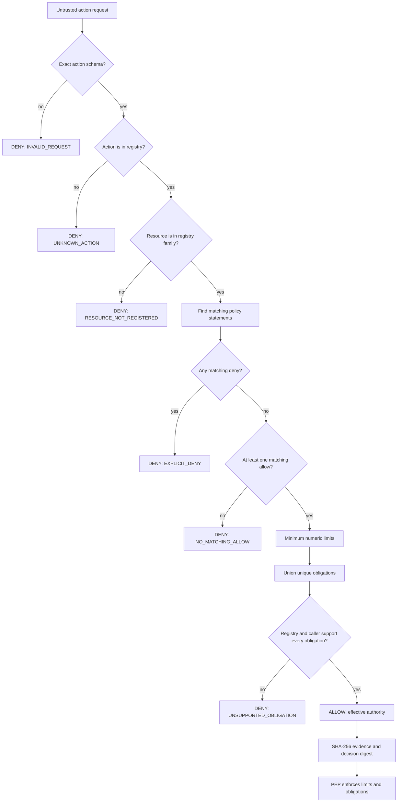
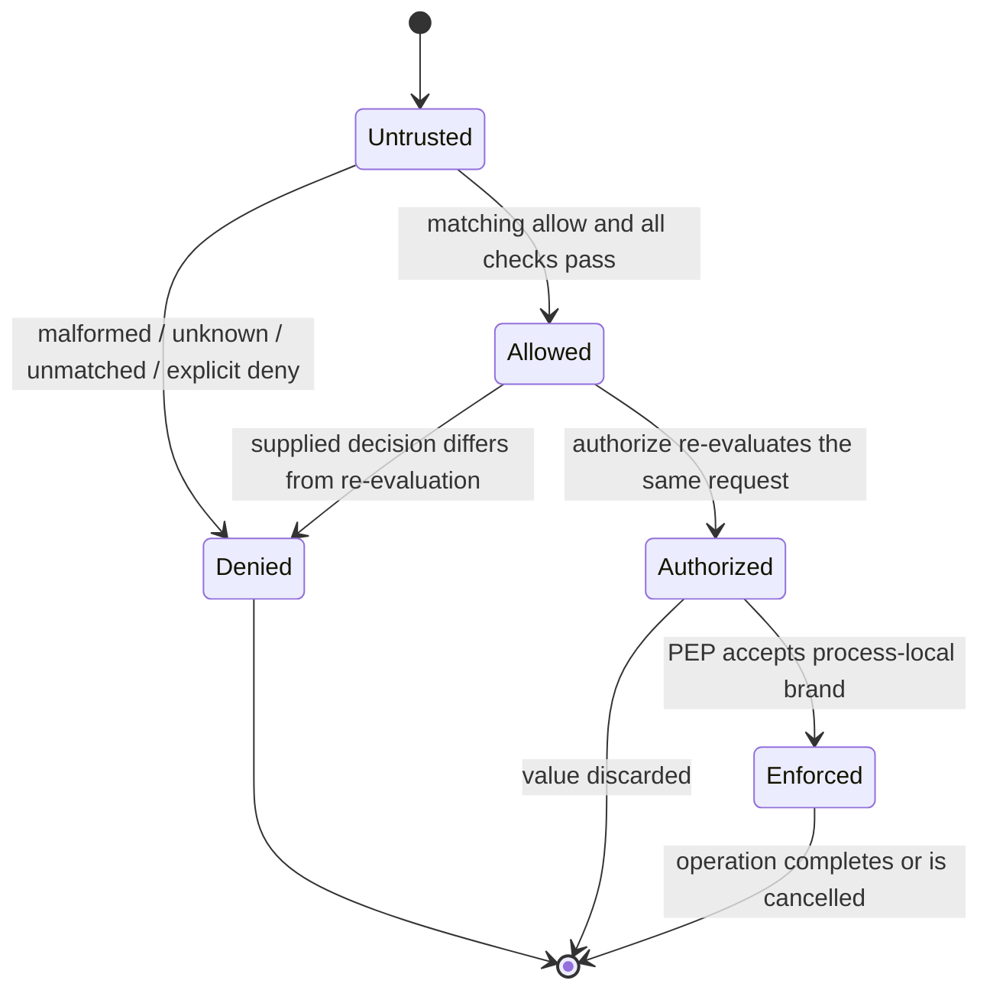
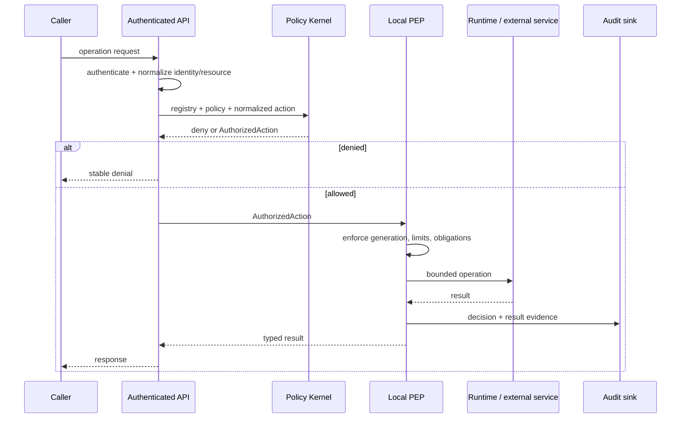
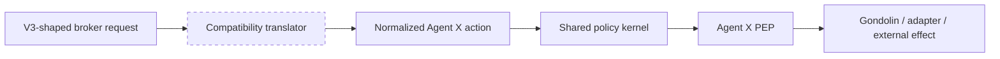

# Agent X Policy Kernel

`@agent-x/policy-kernel` is a small, deterministic authorization library. It answers one question:

> Given a reviewed action registry, a policy document, and one requested action, what authority—if any—may the caller exercise?

It does not execute the action. A broker, tool adapter, or other **policy-enforcement point** (PEP) must enforce every returned limit and obligation.

## What confidence this package provides

The kernel provides:

- exact runtime decoding for untrusted policy and action data;
- a closed registry of action names and their permitted resource families;
- deny-overrides evaluation;
- numeric limit attenuation by minimum;
- action-specific, closed obligation support;
- fail-closed results for malformed or unsupported requests;
- SHA-256 decision evidence over canonical JSON;
- a process-local `AuthorizedAction` value that cannot be reconstructed by JSON decoding;
- a plain API and an Effect `Context.Tag`/`Layer` API.

The kernel does **not** provide:

- a sandbox, process boundary, filesystem boundary, or network boundary;
- authentication, identity lookup, transport security, or policy distribution;
- policy signatures or proof that a policy came from a trusted administrator;
- automatic enforcement of limits or obligations;
- persistence, audit delivery, revocation, leases, approvals, or generation fencing;
- a general Rego/Cedar-style policy language.

Treat it as a small authorization compiler embedded inside a larger trusted service.

## Evaluation flow



### Decision statechart

Evaluation has no mutable internal state. The statechart describes the public result transition:



`Allowed` is a data result. `Authorized` is a stronger, process-local value created only by `authorize`. Neither means that the requested operation actually succeeded.

## Install and import

The package is currently a workspace package:

```json
{
  "dependencies": {
    "@agent-x/policy-kernel": "0.1.0",
    "effect": "3.22.0"
  }
}
```

```ts
import {
  AuthorizationDeniedError,
  PolicyKernel,
  authorize,
  decodePolicyAction,
  decodePolicyDocument,
  evaluate,
  isAuthorizedAction,
  makeActionRegistry,
  makePolicyKernel,
  makePolicyKernelLayer,
} from "@agent-x/policy-kernel"
```

## Public contracts

### `ActionDefinition`

An action registry is the reviewed vocabulary of operations the application understands.

```ts
interface ActionDefinition {
  readonly action: string
  readonly resources?: ReadonlyArray<string>
  readonly obligations?: ReadonlyArray<ObligationKind>
}
```

- `action` is an exact action identifier.
- `resources` optionally limits the resource families that action may address. Omit it to permit any non-empty resource string at the registry layer.
- `obligations` lists obligation kinds the action's PEP knows how to enforce. Omit it to support no obligations.

```ts
const registry = makeActionRegistry([
  {
    action: "file.read",
    resources: ["space/project/*"],
    obligations: ["audit", "redact"],
  },
  {
    action: "terminal.exec",
    resources: ["environment:conversation-*"],
    obligations: ["budget", "hard_cancel", "audit"],
  },
])
```

Duplicate or empty action names and unknown obligation kinds are rejected while constructing the registry.

### Resource patterns

Resource matching is deliberately small:

| Pattern | Meaning |
|---|---|
| `space/project/readme` | Exact match only |
| `space/project/*` | Any string beginning with `space/project/` |
| `*` | Every resource string |

Only a final `*` is special. There are no mid-string globs, regular expressions, path normalization, URL parsing, or segment semantics.

Applications should use canonical, typed resource names before calling the kernel. For example, decide whether `space/a/../b` is legal before policy evaluation rather than expecting the kernel to interpret it as a path.

### `PolicyDocument`

```ts
interface PolicyDocument {
  readonly version: 1
  readonly statements: ReadonlyArray<PolicyStatement>
}

interface PolicyStatement {
  readonly effect: "allow" | "deny"
  readonly actions: ReadonlyArray<string>
  readonly resources: ReadonlyArray<string>
  readonly limits?: Readonly<Record<string, number>>
  readonly obligations?: ReadonlyArray<Obligation>
  readonly reason?: string
}
```

Example:

```ts
const policy = decodePolicyDocument({
  version: 1,
  statements: [
    {
      effect: "allow",
      actions: ["file.read"],
      resources: ["space/project/*"],
      limits: { bytes: 1048576 },
      obligations: [
        { kind: "audit", eventClass: "project.file.read" },
      ],
      reason: "project files are readable through the broker",
    },
    {
      effect: "deny",
      actions: ["file.read"],
      resources: ["space/project/secrets/*"],
      reason: "secrets never enter the sandbox",
    },
  ],
})
```

`decodePolicyDocument` rejects unknown object fields, negative/fractional/non-finite limits, unknown obligation shapes, and unsupported document versions.

The `reason` field is explanatory input. It does not alter evaluation and is not copied into the public decision reason codes; it is covered by the policy digest.

### `PolicyAction`

```ts
interface PolicyAction {
  readonly action: string
  readonly resource: string
  readonly parameters?: Readonly<Record<string, JsonValue>>
}
```

`parameters` are canonical JSON facts covered by the action and decision digests. The current evaluator does not branch on parameter values. PEPs may use parameters to bind a decision to the exact request they enforce.

Use `decodePolicyAction` at untrusted boundaries. It rejects unknown top-level fields and non-JSON parameter values such as `undefined`, `BigInt`, functions, symbols, class instances, and non-finite numbers.

### Obligations

The closed obligation kinds are:

- `lease`
- `budget`
- `approval`
- `network`
- `adapter`
- `redact`
- `audit`
- `quarantine`
- `reconciliation`
- `fence`
- `hard_cancel`

An obligation may be its string kind or its typed object form. Object forms carry enforcement data, such as `{ kind: "budget", dimension: "tokens", maximum: 10000 }`.

An allow succeeds only when:

1. the action registry declares that obligation kind for the action; and
2. `EvaluationRequest.supportedObligations`, when supplied, contains that kind.

This two-sided check prevents a policy from silently requiring behavior that the selected PEP cannot perform.

### Numeric limits

For all matching allow statements, the effective value for each numeric dimension is the minimum declared value.

```text
allow A: { bytes: 1000, count: 10 }
allow B: { bytes: 400 }
result:  { bytes: 400, count: 10 }
```

Limit names are application-defined. The kernel does not know that `bytes`, `timeoutMs`, or `cpus` have particular units.

**Critical enforcement rule:** the PEP must compare or clamp the requested operation to `effectiveAuthority.limits`. The kernel does not automatically reject `parameters.requestedLimits.bytes = 1000` when effective `bytes = 400`.

### `PolicyDecision`

```ts
type PolicyDecision = AllowDecision | DenyDecision
```

Allow decisions contain:

- `kind: "allow"`;
- `effectiveAuthority` with action, resource, limits, and obligations;
- `reasonCodes: ["ALLOW"]`;
- decision evidence and digest.

Deny decisions contain:

- `kind: "deny"`;
- stable `reasonCodes`;
- decision evidence and digest;
- no authority.

Stable deny reason codes:

| Code | Meaning |
|---|---|
| `INVALID_REQUEST` | Action decoding failed or authorization input was inconsistent |
| `UNKNOWN_ACTION` | Action is absent from the registry |
| `RESOURCE_NOT_REGISTERED` | Resource is outside the action's registered families |
| `NO_MATCHING_ALLOW` | No policy allow matched |
| `EXPLICIT_DENY` | At least one matching deny matched |
| `UNSUPPORTED_OBLIGATION` | Registry or caller cannot enforce an obligation |

### `evaluate`

```ts
const decision = evaluate({
  registry,
  policy,
  action: {
    action: "file.read",
    resource: "space/project/src/main.ts",
    parameters: { requestedBytes: 4096 },
  },
  supportedObligations: ["audit", "redact"],
})
```

`evaluate` is synchronous, pure, and deterministic for JSON-compatible input. It returns a deny decision instead of throwing for malformed action requests. Policy documents should already have passed `decodePolicyDocument`.

### `authorize` and `AuthorizedAction`

```ts
try {
  const authorized = authorize({ registry, policy, action })
  if (!isAuthorizedAction(authorized)) throw new Error("unreachable")
  await enforceLocally(authorized.authority)
} catch (error) {
  if (error instanceof AuthorizationDeniedError) {
    console.error(error.decision.reasonCodes)
  }
}
```

`authorize` re-evaluates the request. If a caller supplies a prior decision, its digest must equal the fresh result. An allow result is converted into an immutable `AuthorizedAction` tracked by a private `WeakSet`.

Consequences:

- JSON serialization loses authorization.
- Copying fields into a new object loses authorization.
- A value from another installed copy or JavaScript realm of this package is not recognized.
- Restarting the process invalidates all prior values.

This brand reduces accidental confused-deputy mistakes inside one process. It is not a transferable token, capability signature, or remote credential.

### `makePolicyKernel` and Effect integration

```ts
const kernel = makePolicyKernel(registry)
const policy = kernel.decodePolicyDocument(rawPolicy)
const decision = kernel.evaluate({ policy, action })
const authorized = kernel.authorize({ policy, action })
```

The service inserts its configured registry when the request does not explicitly provide one.

For an Effect application:

```ts
import { Effect } from "effect"
import { PolicyKernel, makePolicyKernelLayer } from "@agent-x/policy-kernel"

const program = Effect.gen(function* () {
  const kernel = yield* PolicyKernel
  return kernel.authorize({ policy, action })
})

const runnable = program.pipe(
  Effect.provide(makePolicyKernelLayer(registry)),
)
```

## Digest and evidence semantics

`deterministicDigest` canonicalizes JSON object keys and hashes the resulting bytes with SHA-256. Decision evidence includes:

- `policyDigest`;
- `actionDigest`;
- stable reason codes;
- an overall evidence digest used as the decision digest.

The digest detects accidental or adversarial changes only when a trusted component already knows the expected digest. It is **not** a signature or MAC. Anyone who can replace the policy can compute a new valid digest.

Quirks to understand:

- Object key order does not change a digest.
- Array order does change a digest. Reordering semantically equivalent policy statements produces a different policy and decision digest.
- Obligation output preserves the first matching occurrence while deduplicating later identical canonical values.
- Policy statement `reason` text affects the policy digest even though it does not alter authorization semantics.

## Recommended integration pattern



Keep policy evaluation and enforcement adjacent. Do not send `AuthorizedAction` over RPC. For remote services, transmit a reviewed request envelope and have the remote service re-evaluate or verify a separately designed signed capability.

## Flexibility and extension

The kernel is intentionally extensible only at reviewed code/data boundaries:

- add an action by updating the application's action registry;
- add a resource family through that action definition;
- use application-specific numeric limit names;
- add policy statements without changing evaluator code;
- select a subset of obligations supported by a particular PEP.

Adding a new obligation kind requires a package code change and tests because obligation data changes the enforcement contract. This is intentional: unknown obligations fail closed.

The current schema has no principal, tenant, time, group, request origin, or environmental predicates. Encode canonical scope into action/resource identifiers only when that representation remains reviewable. If policy truly needs typed identity or contextual predicates, extend the schema and evaluator rather than putting an ad hoc expression language in `parameters`.

## V3 compatibility debt and Agent X follow-ups

The package was extracted while replacing the V3 Gondolin broker. V3 is a behavioral baseline, not the target product model. The new HTTP broker intentionally does **not** preserve V3's framed Unix-socket transport, request envelopes, or module layout. It does preserve enough V3 semantics to compare runtimes: environment generations, worklanes, bounded exec/file operations, and local policy checks.

The following compromises are explicit. They must not quietly become permanent Agent X contracts:

| Current choice | Why it exists now | Agent X ideal | Required follow-up |
|---|---|---|---|
| Flat string `action` and `resource` fields | Fits the V3 broker's operation dispatch and environment keys | Typed principal, space, conversation/task, worker, capability, source/resource scope, and runtime generation | Add a versioned normalized Agent X action envelope; keep compatibility translation at the broker edge |
| Broker resources such as `environment:<id>/file:<path>` | Maps directly to the V3 environment/VFS model | Canonical product-owned resource IDs, separate from transport and filesystem spellings | Introduce typed resource constructors and canonicalization before evaluation |
| No principal or subject in `PolicyAction` | The credential-free V3 spike has one local socket owner | Explicit principal/service/agent/worker identity and delegation chain | Add typed principal and delegation facts; never infer identity from ambient process context |
| No grant, approval, or capability reference | V3 policy is static configuration | References to product-owned grants/approvals with generation, expiry, scope, and single-use/idempotency state | Keep mutable facts in Agent X/PostgreSQL; pass immutable snapshots/references to the kernel and consume transactionally at the PEP |
| Policy generation lives in the broker config/registry, not `PolicyDocument` | V3 already fences environment lifecycle separately | One authorization snapshot bound to policy, runtime, adapter, lease, and product generations | Define an `AuthorizationSnapshot` contract and include its digest/generations in decisions and audit records |
| Generic `Record<string, number>` limits | V3 worklanes use several unrelated ceilings | Closed, unit-bearing budget types per action/capability | Replace generic dimensions action-by-action once Agent X PEP contracts stabilize |
| `parameters` are digest-bound but not evaluated | Preserves exact V3 request binding without inventing expressions | Typed action-specific facts evaluated by reviewed constructors | Add action schemas/normalizers to the registry; do not add arbitrary callbacks or an expression language |
| Obligation vocabulary exists, but the credential-free broker declares `supportedObligations: []` | The spike does not yet implement approvals, credentials, audit delivery, redaction, or reconciliation | Each PEP advertises and proves the obligations it enforces | Implement obligation handlers and tests one PEP at a time; until then policies containing obligations deny |
| Limits and obligations are returned, not enforced | Keeps the kernel pure and reusable | Local PEP atomically enforces authority, consumption, fencing, result publication, and audit | Add shared enforcement helpers plus transactional consumption/reconciliation in Agent X services |
| Process-local `WeakSet` brand | Prevents accidental in-process fabrication cheaply | Still process-local for local calls; explicit signed/verified capability only if a remote boundary is justified | Never serialize the brand. Design a separate remote capability protocol with audience, expiry, operation digest, generation, and replay defense |
| Default registry includes broad future Agent X action names | Makes the fake package independently illustrative | Product registries generated from real service contracts | Broker uses its own closed registry now; replace illustrative defaults with contract-owned registries before production |

### Compatibility boundary



The compatibility translator is the only correct place for V3 spellings. The kernel must not acquire broker protocol fields, VM handles, SQL repositories, HTTP types, or legacy request unions.

### Follow-up acceptance gates

Do not call the policy layer “Agent X complete” until:

1. principal/delegation and space/task/worker identity are explicit and schema-validated;
2. normalized action/resource constructors are owned by product contracts rather than broker string formatting;
3. decisions bind policy/runtime/adapter/product generations and freshness;
4. grants, approvals, budgets, and idempotency are transactionally consumed by their owning services;
5. every advertised obligation has a real PEP implementation and failure test;
6. decision, enforcement, result, and publication evidence can be correlated without treating the digest as an audit log;
7. legacy/V3 translation is isolated, measured, and removable.

## Operational limitations

1. **Policy provenance is external.** Load policy from an immutable/trusted source; a valid schema and digest do not establish provenance.
2. **Generation fencing is external.** Include policy/runtime generations in the surrounding service's records and reject stale work there.
3. **Revocation is external.** Re-evaluate before each authority-bearing operation and invalidate broker-local leases on policy promotion.
4. **Audit is external.** An `audit` obligation is a requirement for the PEP, not evidence that an event was delivered.
5. **Concurrency is external.** The kernel is pure and thread-safe; it does not reserve budgets or serialize consumption.
6. **Limit accounting is external.** Minimum limits are static ceilings, not transactional counters.
7. **No negative resource grammar.** Use explicit deny statements, not exclusion globs.
8. **No statement IDs.** Evidence identifies the whole policy/action and reason codes, not individual matched statements.

## Security review checklist

Before adding a PEP:

- [ ] Action exists in a reviewed registry.
- [ ] Resource has one canonical representation.
- [ ] Registry resource families are no wider than necessary.
- [ ] Untrusted policy/action input passes exact decoders.
- [ ] Every effective numeric limit is enforced at the operation boundary.
- [ ] Every possible obligation is implemented or declared unsupported.
- [ ] Explicit deny cases cover sensitive sub-resources.
- [ ] Policy source, generation, promotion, and rollback are trusted and auditable.
- [ ] `AuthorizedAction` stays in-process and is re-evaluated across trust boundaries.
- [ ] Decision/result audit records are emitted by the PEP.

## Testing

```sh
npm test
```

The suite covers deny precedence, exact and wildcard resource matching, registry constraints, numeric attenuation, unsupported obligations, strict decoding, unforgeable process-local authorization, canonical SHA-256 behavior, and a fixed digest vector.
